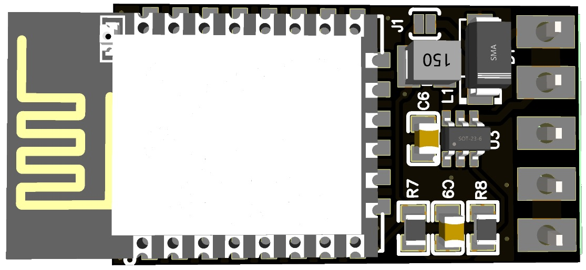
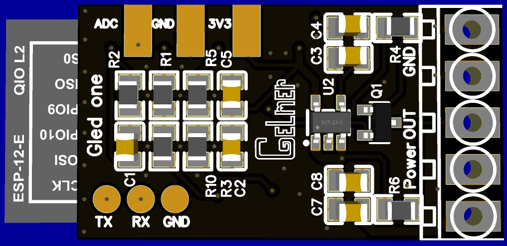
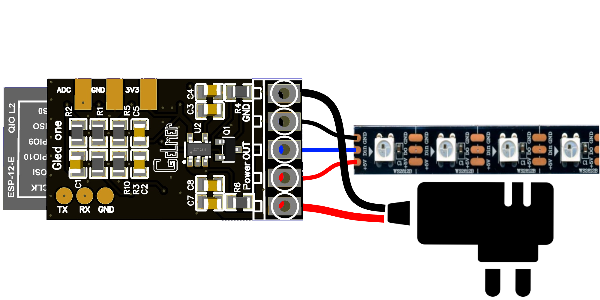
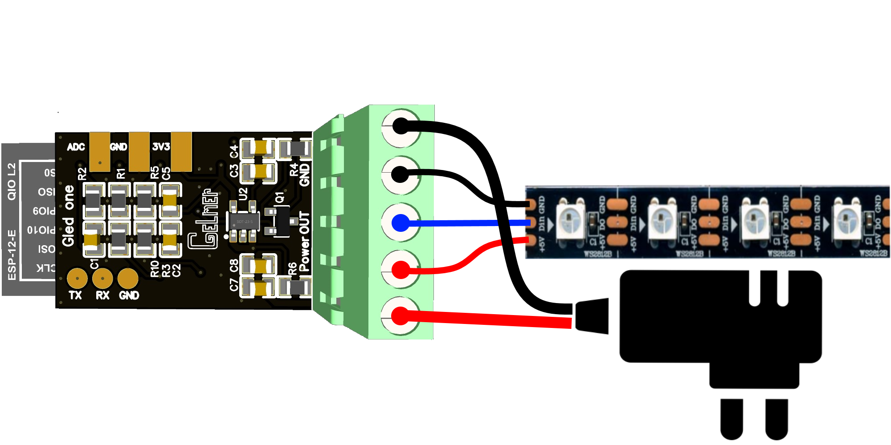

# GLED One
## Addressable light strip controller

## Плата для управления адресными лентами и гирляндами прошивкой WLED

Многие используют адресные ленты и гирлянды. Но проблема в том что часто возникают проблемы при подключении лент, из-за несоответсвия уровней логики у чипов ленты и ЕСП. Решено было реализовать собственную плату, в которой эти проблемы решены.

Основой платы является контроллер ESP8266. Как известно при подключении лент к пинам контроллера напрямую зачастую возникают проблемы, из за несоответствия уровней логики. На плате реализован level shifter который обеспечивает необходимые уровни. 
Платы выпускаются двух видов:  на 5 Вольт, и на 12-24 вольт.
 Основных коннекторов 5: два питания, два земля, и сигнальный.

Так же дополнительно выведены ADC, TX, RX. С выводом ADC возможно реализовать управление звуком.

## Схема подключения платы:
### Платы бывают с винтовыми разъемами, или просто контактными площадками под пайку. 

Управляющий вывод для ленты GPIO14.

Платы можно приобрести в [магазине](https://espdomofon.ru/). Как обычно, платы прошитые, готовы к работе из коробки.
